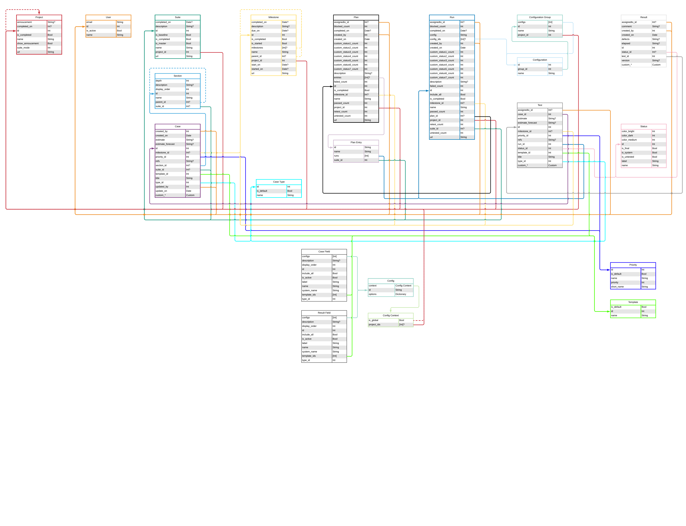

# QuizTrain 📝🚆

QuizTrain is a framework created at Venmo allowing you to interact with [TestRail's API](http://docs.gurock.com/testrail-api2/start) using Swift. It supports iOS, macOS, tvOS, and watchOS.

To use QuizTrain you must have a valid [TestRail](http://www.gurock.com/testrail/) license and instance to access.

## Licensing

QuizTrain is open source software released under the MIT License. See the [LICENSE](LICENSE) file for details.

## Installation

[Carthage](https://github.com/Carthage/Carthage) is the recommended way to install QuizTrain. Add the following to your `Cartfile` or `Cartfile.private` file:

    github "venmo/QuizTrain" ~> 1.1.0

See [Adding frameworks to an application](https://github.com/Carthage/Carthage#adding-frameworks-to-an-application) for further instructions. Once complete `import QuizTrain` in any Swift files you wish to use QuizTrain in.

## Usage

Create an `ObjectAPI` to get, add, update, delete, and close items on your TestRail instance.

    let objectAPI = ObjectAPI(username: "your@testRailAccount.email", secret: "your_api_key_or_password", hostname: "yourInstance.testrail.net", port: 443, scheme: "https")

Alternatively you can use `API` directly if you would rather work with basic Swift types. Generally it is better to use `ObjectAPI` as `API` is a lower level of abstraction. For differences see comments in [API.swift](QuizTrain/Network/API.swift) and [ObjectAPI.swift](QuizTrain/Network/ObjectAPI.swift).

## Examples

Below shows a limited number of examples. For all examples see [ObjectAPITests.swift](QuizTrainTests/Network/ObjectAPITests.swift).

#### Get all Cases in a Project

    objectAPI.getCases(inProjectWithId: 5) { (outcome) in
        switch outcome {
        case .failed(let error):
            print(error.debugDescription)
        case .succeeded(let cases):
            print(cases) // Do something with cases.
        }
    }

#### Add a Case

    let section: Section = ...
    let newCase = NewCase(estimate: nil, milestoneId: nil, priorityId: nil, refs: nil, templateId: nil, title: "New Case Title", typeId: nil, customFields: nil)
    
    objectAPI.addCase(newCase, to: section) { (outcome) in
        switch outcome {
        case .failed(let error):
            print(error.debugDescription)
        case .succeeded(let `case`):
            print(`case`.title) // Do something with the newly created `case`.
        }
    }

#### Update a Suite

    var suite: Suite = ...
    suite.description = "Updated description for this suite."
    suite.name = "Updated name of this suite."
    
    objectAPI.updateSuite(suite) { (outcome) in
        switch outcome {
        case .failed(let error):
            print(error.debugDescription)
        case .succeeded(let updatedSuite):
            print(updatedSuite.description) // "Updated description for this suite."
            print(updatedSuite.name) // "Updated name of this suite."
        }
    }

#### Delete a Section

    let section: Section = ...
    
    objectAPI.deleteSection(section) { (outcome) in
        switch outcome {
        case .failed(let error):
            print(error.debugDescription)
        case .succeeded(_): // nil on successful deletes
            print("The section has been successfully deleted.")
        }
    }

#### Close a Plan

    let plan: Plan = ...
    
    objectAPI.closePlan(plan) { (outcome) in
        switch outcome {
        case .failed(let error):
            print(error.debugDescription)
        case .succeeded(let closedPlan):
            print(closedPlan.isCompleted) // true
            print(closedPlan.completedOn) // timestamp
        }
    }

#### Get a Relationship

    let milestone: Milestone = ...
    
    milestone.parent(objectAPI) { (outcome) in
        switch outcome {
        case .failed(let error):
            print(error.debugDescription)
        case .succeeded(let optionalParent):
            if let parent = optionalParent {
                print("Milestone \(milestone.id) has a parent with an id of \(parent.id).")
            } else {
                print("Milestone \(milestone.id) does not have a parent.")
            }
        }
    }

#### Get Completed Runs in a Project using a single Filter

    let filters = [Filter(named: "is_completed", matching: true)]
    
    objectAPI.getRuns(inProjectWithId: 3, filteredBy: filters) { (outcome) in
        switch outcome {
        case .failed(let error):
            print(error.debugDescription)
        case .succeeded(let completedRuns):
            for completedRun in completedRuns {
                print(completedRun.isCompleted) // true
            }
        }
    }

#### Get Plans in a Project using multiple Filters

    let project: Project = ...
    let filters = [Filter(named: "offset", matching: 3),
                   Filter(named: "limit", matching: 5)]
    
    objectAPI.getPlans(in: project, filteredBy: filters) { (outcome) in
        switch outcome {
        case .failed(let error):
            print(error.debugDescription)
        case .succeeded(let plans): // There will be 5 or less plans.
            for plan in plans {
                print(plan.name)
            }
        }
    }

## Error Handling

It is up to the consumer of QuizTrain to handle all errors. However `ObjectAPI` will handle 429 Too Many Request (rate limit reached) errors automatically unless you set `.handle429TooManyRequestErrors` to `false`.

Errors are defined here:

- [API.swift](QuizTrain/Network/API.swift) in the *Errors* section.
- [ObjectAPI.swift](QuizTrain/Network/ObjectAPI.swift) in the *Errors* section.

You can handle errors two ways:

1. Simply by using `error.debugDescription` to print a rich description of an error.
    - *Provided by errors conforming to `DebugDescription`.*
2. Advanced by `switch`'ing on an error.

Simple is best for debugging and logging. Advanced is best for everything else.

All API and ObjectAPI errors conform to [`DebugDescription`](QuizTrain/Misc/Debug/DebugDescription.swift). If these errors print a `URLRequest` through this protocol then its `AUTHORIZATION` header will be stripped to avoid exposing your TestRail credentials.

### Example

This shows both simple and advanced error handling when adding a new Case to a Section.

#### Setup

    let newCase = NewCase(estimate: nil, milestoneId: nil, priorityId: nil, refs: nil, templateId: nil, title: "New Case Title", typeId: nil, customFields: nil)

#### Simple

    objectAPI.addCase(newCase, toSectionWithId: 5) { (outcome) in
        switch outcome {
        case .failed(let error):
            print(error.debugDescription)
        case .succeeded(let `case`):
            print(`case`.title) // Do something with the newly created `case`.
        }
    }

#### Advanced

    objectAPI.addCase(newCase, toSectionWithId: 5) { (outcome) in
        switch outcome {
        case .failed(let error):
            switch error {
            case .apiError(let apiError): // API.RequestError
                switch apiError {
                case .error(let request, let error):
                    print(request)
                    print(error)
                case .invalidResponse(let request, let response):
                    print(request)
                    print(response)
                case .nilResponse(let request):
                    print(request)
                }
            case .dataProcessingError(let dataProcessingError): // ObjectAPI.DataProcessingError
                switch dataProcessingError {
                case .couldNotConvertDataToJSON(let data, let error):
                    print(data)
                    print(error)
                case .couldNotDeserializeFromJSON(let objectType, let json):
                    print(objectType)
                    print(json)
                case .invalidJSONFormat(let json):
                    print(json)
                }
            case .objectConversionError(let objectConversionError): // ObjectAPI.ObjectConversionError
                switch objectConversionError {
                case .couldNotConvertObjectsToData(let objects, let json, let error):
                    print(objects)
                    print(json)
                    print(error)
                case .couldNotConvertObjectToData(let object, let json, let error):
                    print(object)
                    print(json)
                    print(error)
                }
            case .statusCodeError(let statusCodeError): // ObjectAPI.StatusCodeError
                switch statusCodeError {
                case .clientError(let clientError): // ObjectAPI.ClientError
                    print(clientError.message)
                    print(clientError.statusCode)
                    print(clientError.requestResult.request)
                    print(clientError.requestResult.response)
                    print(clientError.requestResult.data)
                case .otherError(let otherError): // API.RequestResult
                    print(otherError.request)
                    print(otherError.response)
                    print(otherError.data)
                case .serverError(let serverError): // ObjectAPI.ServerError
                    print(serverError.message)
                    print(serverError.statusCode)
                    print(serverError.requestResult.request)
                    print(serverError.requestResult.response)
                    print(serverError.requestResult.data)
                }
            }
        case .succeeded(let `case`):
            print(`case`.title) // Do something with the newly created `case`.
        }
    }

## Testing

See the [QuizTrainTests Readme](QuizTrainTests/README.md).

## Entities

